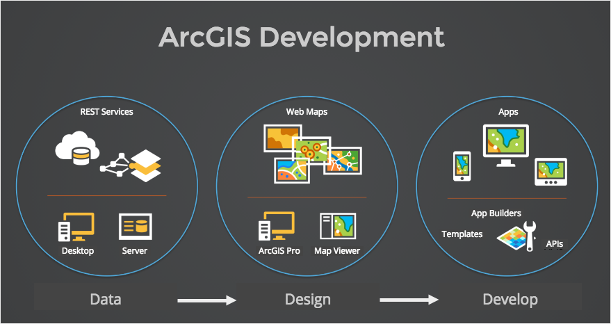
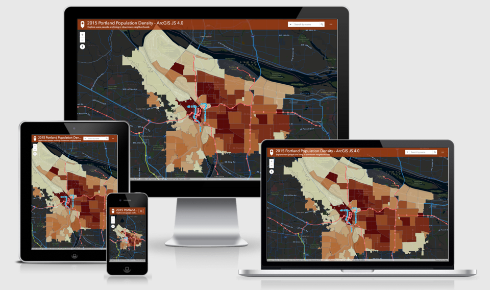

# ArcGIS Geodev Hackerlabs

A place to learn how to build geo apps with ArcGIS.

## Welcome

This repository contains short labs that step you through the process of developing applications with [ArcGIS](http://www.arcgis.com). The process described here makes use of ArcGIS Online accounts and services, and does not require the installation of desktop software for most of the labs. 

The process involves three steps:

1. Data - Preparing data for your apps with [ArcGIS Online](http://www.arcgis.com).
2. Design - Styling layers and maps for your apps with the [ArcGIS Online Map and Scene Viewer](http://www.arcgis.com).
3. Develop - consuming layers and maps in your apps with [ArcGIS Templates, Builders and APIs](http://developers.arcgis.com).

## Getting Started

Here's how to get started:

1. **Sign up for a free [ArcGIS Developer subscription](https://developers.arcgis.com/en/sign-up/)** - Your subscription allows you to download software, register apps, import data, create new services, store maps, perform spatial analysis and more. If you already have an [ArcGIS Organizational subscription](http://www.arcgis.com/features/plans/pricing.html), you can use that too, but please note that [free public accounts](https://geonet.esri.com/groups/geodev/blog/2014/10/15/help-i-cant-get-into-developersarcgiscom) will not work.

2. **Start the labs** - You can complete the labs in order or just pick and choose the ones you want to do. It will be easiest to use the data provided (Portland open data), but you feel free to substitute with your own data and augment the steps where necessary. 

3. **Share your work** - This is 100% optional, but as you are going through, feel free to [share your work](#want-to-share-your-work) with others participants!

## Resources

Here are the web resources you will need for the labs.

* [ArcGIS for Developers - Account, Documentation, Samples, Apps, Downloads](http://developers.arcgis.com)
* [Esri Open Source Projects - More source code](http://esri.github.io)
* [ArcGIS Online Maps and Apps - Map Viewer, My Content, Item Management](http://arcgis.com)
* [ArcGIS Online Help - Documentation and Tutorials](http://doc.arcgis.com/en/arcgis-online/)
* [JS Bin - Interactive JS coding](http://jsbin.com)

> If you are brand new to ArcGIS, we recommend that you use your developer account to sign into [developers.arcgis.com](http://developers.arcgis.com) to explore all of the resources above and then sign into [ArcGIS.com](https://www.arcgis.com) to learn how to [create your first map](http://doc.arcgis.com/en/arcgis-online/create-maps/make-your-first-map.htm).

## Labs

The labs start from ground-zero and work through the Data - Design - Develop process. In this case we use Portland open data, but feel free to use your own to build your own custom solutions.

Let's get started!

> For additional guidance, you might find it helpful to follow along with the [Hackerlab Slides](http://slides.com/alaframboise/geodev-hackerlabs).

### 1. Data

Creating and importing data interactively is a fast and effective way to prepare data for prototype apps or for production-level apps that you plan to develop in the future.

These labs illustrate how to import, create and manage data using the [ArcGIS Online](http://arcgis.com) and [ArcGIS for Developers](http://developers.arcgis.com) website and tools. You will also use the map viewer to perform data enrichment, the process of adding social demographic information to a dataset, and spatial analyses, the process of creating new data based on spatial criteria. You will also explore the feature service REST endpoints and use them in a simple web app to access and display spatial data. 

ArcGIS Online and Developer Tools
* [Import Data](./data/import_data.md)
* [Create and Edit Data](./data/create_and_edit_data.md)
* [Share Data](./data/share_data.md)
* [View via REST](./data/view_via_rest.md)
* [View in a Map](./data/view_in_a_map.md)
* [GeoEnrich Data](./data/geoenrich_data.md)
* [Create Buffers](/data/create_buffers.md)
* [Create Walk Areas](./data/create_walk_areas.md)
* [Extract Walkable Neighborhoods](./data/extract_walkable_neighborhoods.md)
* [Filter Data](./data/filter_data.md)
* [Create Authenticated Traffic Layer](./data/create_authenticated_traffic_layer.md)

Code
* [Add a layer to an app](./develop/add_feature_layer_jsapi.md)
* [GeometryEngine Buffering](./develop/geometry_engine_buffer_jsapi.md)
 
### 2. Design

Creating web maps with great cartography is one of the most important steps to building effective mapping applications. Styling maps interactively can also be huge time-saver in app development.

In these labs you will use [ArcGIS Online](http://arcgis.com) and the map viewer to create and style web maps. You will create new maps, explore basemaps, search for layers, use smart mapping to change symbol styles, style popups, label data, show/hide fields, filter data, and more. You will also learn how to save web maps and featurelayers and use the JSON to achieve the same rich cartographic and popup experiences in your own custom apps.

Tools
* [Create a New Web Map](./design/create_a_new_map.md)
* [Style a Web Map](./design/style_a_map.md)
* [Style Popups](./design/style_popups.md)
* [Smart Mapping - Proportional Styling](./design/smart_mapping_proportional.md)
* [Copy and save a Layer](./design/save_a_layer.md)
* [Vector Basemaps](./design/vector_basemaps.md)
* [Customize Vector Basemap](./design/customize_vector_map.md)
* [Create a new 3D Scene](./design/create_a_new_3d_scene.md)

Code
* [Add a styled layer to an app - Bonus section](./develop/add_feature_layer_jsapi.md)
* [Style a layer with JSON](./develop/style_feature_layers_json_jsapi.md)
* [Style a layer popup](./develop/style_simple_popup_jsapi.md)
* [Style a layer with a renderer](./develop/style_feature_layers_jsapi.md)
* [Add a vector tiled basemap](./develop/add_vector_tile_basemap_jsapi.md)

### 3. Develop

One of the easiest ways to build a map app is to start from web map.

In these labs you will use the ArcGIS Web App Builder, App Templates and APIs to build custom mapping apps. You will use the web maps with the Web AppBuilder to create an HTML5 responsive app or AppStudio to build and deploy a native app for iOS and Android. Or you can just build a custom app from the ground up with the ArcGIS JS API, Esri-Leaflet or the ArcGIS Runtime APIs.

* Web Map Apps
 * [Create a Template App](./develop/create_a_template_app.md)
 * [Create a Web AppBuilder App](./develop/create_a_wab_app.md)
 * [Create a Web Map JS API App](./develop/create_a_web_map_app.md)
 * [Create an AppStudio App](./develop/create_an_appstudio_app.md)

* JS API
 * [Build a Starter Map](./develop/build_starter_map_jsapi.md)
 * [Add Feature Layer](./develop/add_feature_layer_jsapi.md)
 * [Add Feature Layers](./develop/add_feature_layers_jsapi.md)
 * [Add Vector Tile Basemap](./develop/add_vector_tile_basemap_jsapi.md)
 * [Style Feature Layers](./develop/style_feature_layers_jsapi.md)
 * [Style Feature Layers with JSON](./develop/style_feature_layers_json_jsapi.md)
 * [Add GeoJSON Layer](./develop/add_geojson_layer_jsapi.md)
 * [Simple Search](./develop/simple_search_jsapi.md)
 * [Feature Layer Search](./develop/feature_layer_search_jsapi.md)
 * [Client-side Buffering](./develop/geometry_engine_buffer_jsapi.md)
 * [Smart Mapping](./develop/smartmapping_color_renderer_jsapi.md)
 * [Using HTML5 to Query](./develop/html5_query.md)

* JS API 4 Beta 3
 * [Build a Starter 3D Map](./develop/build_starter_3Dmap_jsapi4b3.md)
 * [Extrude data as Polygons in 3D](./develop/extrude_polygon_3d_jsapi4b3.md)

* Esri-Leaflet
 * [Build a Starter Map](./develop/build_starter_map_leaflet.md)
 * [Add Feature Layers](./develop/add_feature_layers_leaflet.md)
 * [GeoEnrich address searches](./develop/enrich_address_search_leaflet.md)
 * [Add Geolocation](./develop/add_geolocation_leaflet.md)
 * [Use Geolocation to Query](./develop/locate_query_leaflet.md)
 * [Use Geolocation (and turf) to Query](./develop/locate_turf_leaflet.md)

* Bootstrap
 * [Build a Starter Bootstrap Map](./develop/build_starter_map_bootstrap.md)
 * [Add Navbar and Menu](./develop/add_navbar_menu_bootstrap.md)

* Web AppBuilder Developer Edition
 * [Setup Development Environment](./develop/wab_ide_install.md)
 * [Add a Custom Widget](./develop/wab_custom_widget.md)
 * [Add a Custom Configurable Widget](./develop/wab_config_widget.md)
 * [Deploy to ArcGIS Online](./develop/wab_deploy.md)

## Want to share your work?

1. Login to [ArcGIS Online](http://arcgis.com).
 * Search for `Geodev Hackerlabs Share` > `Search Groups`.
 * Uncheck `Only search in my account/organization`.
 * Join the group.
 * Share your own items.

## Want to help?

1. [Sign up](https://github.com/join) for a GitHub account (if you don't already have one).
2. Let us know what works for you and what doesn't in [an issue](https://github.com/Esri/geodev-hackerlabs/issues/new)
3. If you're already savvy with [git](https://git-scm.com/) (or want an excuse to start learning), feel free to fork the repo and send us a pull request!  There is lots on the web to help you get started, but we especially like the stuff [here](https://guides.github.com/).

## Data and Terms of Use

Please see [www.civicapps.org](http://www.civicapps.org/), [developer.trimet.org/gis](developer.trimet.org/gis) and [http://www.portlandoregon.gov/bts](http://www.portlandoregon.gov/bts) for the data terms of use.

## Licensing
Copyright 2016 Esri

Licensed under the Apache License, Version 2.0 (the "License");
you may not use this file except in compliance with the License.
You may obtain a copy of the License at

> http://www.apache.org/licenses/LICENSE-2.0

Unless required by applicable law or agreed to in writing, software
distributed under the License is distributed on an "AS IS" BASIS,
WITHOUT WARRANTIES OR CONDITIONS OF ANY KIND, either express or implied.
See the License for the specific language governing permissions and
limitations under the License.

A copy of the license is available in the repository's [LICENSE](./license.txt) file.

