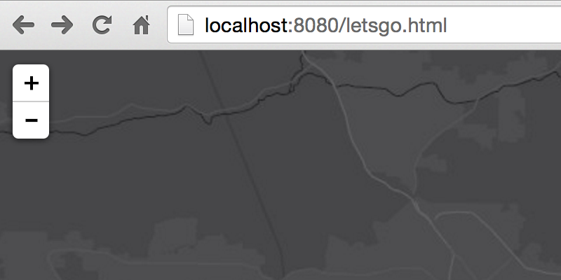
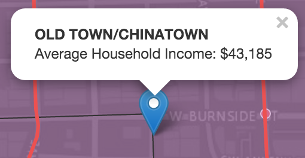

# Display Demographic data when users search for an address

In this lab we'll write a [Leaflet](https://leafletjs.com) application that uses Esri [GeoEnrichment](https://developers.arcgis.com/en/features/geo-enrichment/) services to provide demographic context when users search for an address.

> ### 1. Lets get our development environment set up.

Copy the example from our [Add Feature Layers Esri Leaflet exercise](add_feature_layers_leaflet.md) into a new `.html` file on your own machine and open it via `http://` protocol in your browser. (somewhere like http://0.0.0.0/myveryownmap.html)

> Do you have a local web server running? 
> If not, you can find information about setting one up [**here**](https://gist.github.com/jgravois/5e73b56fa7756fd00b89).

> ### 2. Add address search to our application

We can rip off the sample [here](http://esri.github.io/esri-leaflet/examples/search-map-service.html).  our job is to determine what code we need to copy/paste/modify to get address search working in our *own* app.

> ### 3. Seize the opportunity to find out which neighborhood the address is inside

We'll need to use an [event listener](http://esri.github.io/esri-leaflet/api-reference/controls/geosearch.html#Results) to get a reference to the coordinates of the found address.  Afterward we can use [`L.esri.featureLayer.query`](http://esri.github.io/esri-leaflet/api-reference/layers/feature-layer.html) to see what neighborhood the address is inside.

> ### 4. ... and show our demographic data in a popup

Last, we'll add a Leaflet [Marker](http://leafletjs.com/reference.html#marker) to the map and define a popup for it.

In the end, hopefully your app will look *kinda, sorta* like [**this**](http://bl.ocks.org/jgravois/d998363818666f5363ef).
---
### Resources

* [leaflet API reference](http://leafletjs.com/reference.html)
* [esri leaflet API reference](http://esri.github.io/esri-leaflet/api-reference/)
* [esri leaflet samples](http://esri.github.io/esri-leaflet/examples/)

### Bonus
> are you thirsty for more?

* add some custom styling to the marker that you draw when an address match is found
* [refactor the logic](locate_turf_leaflet.md) to use turf to query the neighborhoods locally
* use [Geoenrichment](https://developers.arcgis.com/en/features/geo-enrichment/) on the fly (and skip preprocessing the data)
