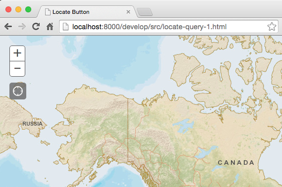
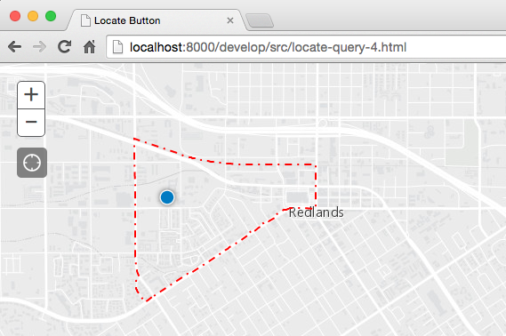

### Use HTML5 location to query a feature service

In this lab we'll write an [ArcGIS API for Javascript](https://developers.arcgis.com/javascript/) application that uses [HTML5](https://developer.mozilla.org/en-US/docs/Web/Guide/HTML/HTML5) to glean a user's location and find out which census block they are inside.

1. Copy the contents of [step_1.html](step_1.html) into a new `.html` file on your own machine and open it via `http://` protocol in your browser.

    > Don't have a local web server running? 
    > You can find information to help you set one up [**here**](https://gist.github.com/jgravois/5e73b56fa7756fd00b89).

    

    > because of security rules introduced in Chrome 50 (on [4/20/2016](https://developers.google.com/web/updates/2016/04/geolocation-on-secure-contexts-only)), it is mandatory to configure https in order to take advantage of HTML5 location when you move your website into production.

2. Listen for the appropriate [event](https://developers.arcgis.com/javascript/jsapi/locatebutton-amd.html#event-locate) to retrieve the current user's location (once it's available).

    

3. Include a [QueryTask](https://developers.arcgis.com/javascript/jsapi/querytask-amd.html) to pass the user location in a request to an Esri service that hosts [US Census Block Groups](http://sampleserver6.arcgisonline.com/arcgis/rest/services/Census/MapServer/1).

4. Draw the feature that is retrieved as a new [Graphic](https://developers.arcgis.com/javascript/jsapi/graphic-amd.html) on the map.

In the end your app should look something like this:
* [Code](index.html)
* [Live App](https://esri.github.io/geodev-hackerlabs/develop/jsapi3/search_with_html5_location/index.html)

---
### Resources
> ie: sample code ripe for stealing

* [Locate Widget](https://developers.arcgis.com/javascript/jssamples/widget_locate.html)
* [Select features within a two minute drive time](https://developers.arcgis.com/javascript/jssamples/fl_selection.html)
* [Query data without a map](https://developers.arcgis.com/javascript/jssamples/query_nomap.html)

### Bonus
> are you thirsty for more?

* pan/zoom the map to the [extent](https://developers.arcgis.com/javascript/jsapi/polygon-amd.html#getextent) of the census block being drawn.
* customize census block symbology and give it a popup.
* add nearby census block features when the page loads and use our new [GeometryEngine](https://developers.arcgis.com/javascript/jsapi/esri.geometry.geometryengine-amd.html#contains) for the query (instead of making a request to the ArcGIS Service).
* use [Geoenrichment](https://developers.arcgis.com/javascript/jsapi/studyarea-amd.html) to find out the total population of the census block.
* create a 3D version of the application using the [JS API 4.0](https://developers.arcgis.com/javascript/).
