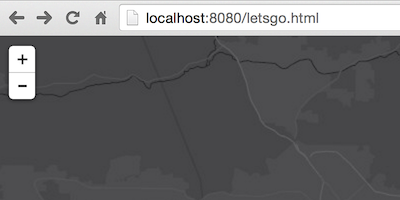
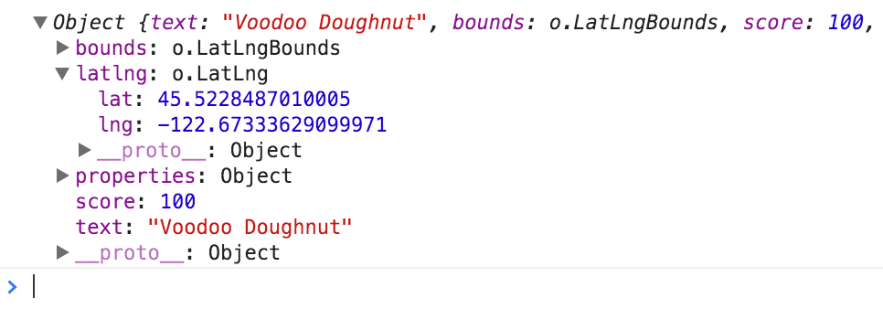
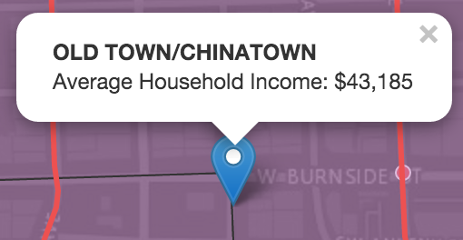

# Display Demographic data when users search for an address

In this lab we'll write a [Leaflet](https://leafletjs.com) application that allows users to search for addresses and points of interest and displays attribute information from an associated neighborhood.

> ### 1. Lets get our [development environment](../../setup_dev_env.md) set up.

For this exercise, we'll use the complete example from the conclusion of our [Add Feature Layers](../add_feature_layer/lab.md) exercise as our jumping off point.



> ### 2. Add address search to our application

We can rip off the sample [here](http://esri.github.io/esri-leaflet/examples/search-map-service.html).  our job is to determine what code we need to copy/paste/modify to get address search working in *our* app.


> ### 3. Seize the opportunity to find out which neighborhood the address is inside

We'll need to use an [event listener](http://esri.github.io/esri-leaflet/api-reference/controls/geosearch.html#Results) to get a reference to the coordinates of the found address.  Afterward we can use [`L.esri.featureLayer.query`](http://esri.github.io/esri-leaflet/api-reference/layers/feature-layer.html) to determine which neighborhood its in.

```js
searchControl.on('results', function (evt) {
  /* 'evt' is a geosearch result object.
  it will include information about the address we just searched for */
})
```



```js
var neighborhoodQuery = neighborhoods.query()
neighborhoodQuery.intersects(/*the geometry of the matched address*/)
neighborhoodQuery.run(function(error, featureCollection){
  // here we'll have a reference to the neighborhood that is coincident with the address
});
```
> ### 4. ... and display the demographic data we dug out

Last, we'll add a Leaflet [Marker](http://leafletjs.com/reference.html#marker) to the map and display attributes from the associated neighborhood to our users.



```js
var income = featureCollection.features[0].properties.AVGHINC_CY
document.getElementById('title').innerHTML = income;
```
In the end, hopefully your app will look *kinda, sorta* like **this**.

 * [Code](index.html)
 * [Live App](http://esri.github.io/geodev-hackerlabs/develop/leaflet/enrich_address_search/index.html)

---
### Resources

* [Leaflet API reference](http://leafletjs.com/reference.html)
* [Esri Leaflet API reference](http://esri.github.io/esri-leaflet/api-reference/)
* [Esri Leaflet samples](http://esri.github.io/esri-leaflet/examples/)

### Bonus
> are you thirsty for more?

* add some custom styling to the marker that you draw when an address match is found
* [refactor the logic](../query_with_html5_location_turf/lab.md) to use turf to query the neighborhoods locally
* use [Geoenrichment](https://developers.arcgis.com/en/features/geo-enrichment/) on the fly (and skip preprocessing the data)
