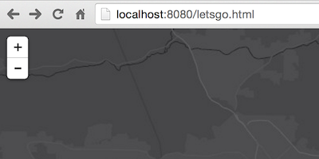
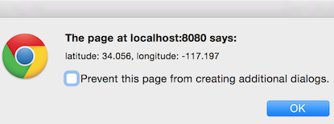
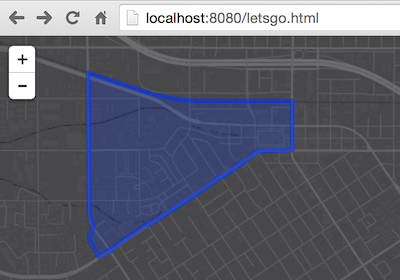

# Use HTML5 location and esri leaflet to query a feature service

In this lab we'll write a [Leaflet](https://leafletjs.com) application that uses [HTML5](https://developer.mozilla.org/en-US/docs/Web/Guide/HTML/HTML5) to glean a user's location and then fire off a spatial query to an Esri service of US Census Blocks to find out which one our end user happens to be inside.

> ### 1. First, lets get our [development environment](../../setup_dev_env.md) set up.

> because of security rules introduced in Chrome 50 (on [4/20/2016](https://developers.google.com/web/updates/2016/04/geolocation-on-secure-contexts-only)), it is mandatory to configure https in order to take advantage of HTML5 location when you move your website into production.

For this exercise, we'll use the complete example from the conclusion of our [starter map](../starter_map/lab.md) exercise as our jumping off point.

> ### 2. Next we need to ask our end user where they are.

Use Leaflet's built in [method](http://leafletjs.com/reference.html#map-set-methods) to ask the user to share their location and make sure to get a reference to it [once it's available](http://leafletjs.com/reference.html#map-events).

> ### 3. Then we ask our ArcGIS service which census block they're inside of.

Create an [`L.esri.query`](http://esri.github.io/esri-leaflet/api-reference/tasks/query.html) object and pass it the user's location.  Afterwards you'll be able to fire a request to an Esri service that hosts [US Census Block Groups](https://sampleserver6.arcgisonline.com/arcgis/rest/services/Census/MapServer/1) to see which block the person is inside.

> ### 4. ... and draw the right one.

Add the feature that is retrieved to the map using Leaflet's [`L.geoJSON`](http://leafletjs.com/reference.html#geojson-l.geojson) class.

In the end, hopefully your app will look *kinda, sorta* like [**this**](https://bl.ocks.org/jgravois/a4a93d907f3aaf3f7340).
---
### Resources

* [leaflet API reference](http://leafletjs.com/reference.html)
* [esri leaflet API reference](http://esri.github.io/esri-leaflet/api-reference/)
* [esri leaflet samples](http://esri.github.io/esri-leaflet/examples/)

### Bonus
> are you thirsty for more?

* add some custom styling to the census block thats drawn
* display a popup with information about the census block
* symbolize the actual user location on the map
* use [Geoenrichment](https://developers.arcgis.com/en/features/geo-enrichment/) to query/display the total population of the census block
* [refactor the logic](../query_with_html5_location_turf/lab.md) to use turf to query census block geometries locally instead
