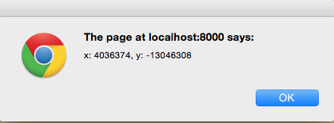
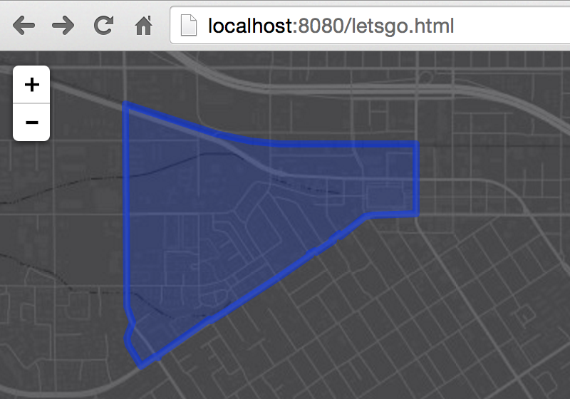

# Use HTML5 location and esri leaflet to query a feature service

In this lab we'll write a [Leaflet](https://leafletjs.com) application that uses [HTML5](https://developer.mozilla.org/en-US/docs/Web/Guide/HTML/HTML5) to glean a user's location and then fire off a spatial query to an Esri service of US Census Blocks to find out which one our end user happens to be inside.

> ### 1. First lets get our development environment set up.

Copy the example from our [starter map exercise](build_starter_map_leaflet.md) into a new `.html` file on your own machine and open it via `http://` protocol in your browser. (somewhere like http://0.0.0.0/myveryownmap.html)

> Do you have a local web server running? 
> If not, you can find information about setting one up [**here**](https://gist.github.com/jgravois/5e73b56fa7756fd00b89).

> ### 2. Next we need to ask our end user where they are.

Use Leaflet's built in [method](http://leafletjs.com/reference.html#map-set-methods) to ask the user to share their location and make sure to get a reference to it [once it's available](http://leafletjs.com/reference.html#map-events).

> ### 3. Then we ask our ArcGIS service which census block they're inside of.

Create an [`L.esri.Tasks.query`](http://esri.github.io/esri-leaflet/api-reference/tasks/query.html) object and pass it the user's location.  afterwards you'll be able to fire a request to an Esri service that hosts [US Census Block Groups](http://sampleserver6.arcgisonline.com/arcgis/rest/services/Census/MapServer/1) to see which block the person is inside.

> ### 4. ... and draw the right one.

Add the feature that is retrieved to the map using Leaflet's [`L.geoJSON`](http://leafletjs.com/reference.html#geojson-l.geojson) class.

In the end, hopefully your app will look *kinda, sorta* like [**this**](http://bl.ocks.org/jgravois/a4a93d907f3aaf3f7340).
---
### Resources

* [leaflet API reference](http://leafletjs.com/reference.html)
* [esri leaflet API reference](http://esri.github.io/esri-leaflet/api-reference/)
* [esri leaflet samples](http://esri.github.io/esri-leaflet/examples/)

### Extras
> are you thirsty for more?

* add some custom styling to the census block thats drawn
* display a popup with information about the census block
* symbolize the actual user location on the map
* use [Geoenrichment](https://developers.arcgis.com/en/features/geo-enrichment/) to query/display the total population of the census block
* [refactor the logic](locate_turf_leaflet.md) to use turf to query census block geometries locally instead
