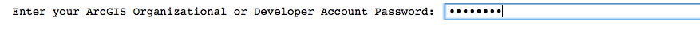
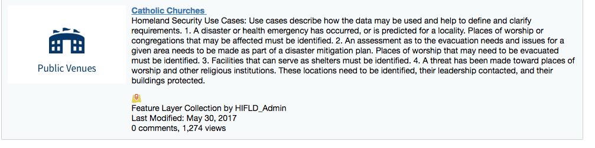
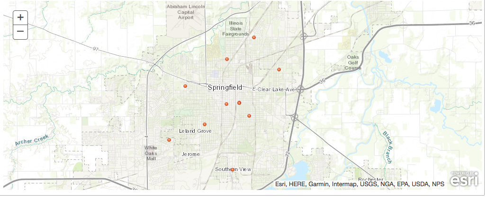

# Add a layer to a map

Login to your ArcGIS Organization and hide the password with the getpass module. The API represents a GIS portal using the GIS class from the gis module. Instantiate your own GIS portal with this class and use its properties property (the **Property Manager** object accessed as a property) to access various information. You can also use the **User Manager** helper class by accessing the _users_ property of the gis class to work with user infromation.

```python
from arcgis.gis import GIS
import getpass

password = getpass.getpass("Enter your ArcGIS Organizational or Developer Account Password: ")
gis = GIS("https://www.arcgis.com", "[your username]", password)
print("Logged in successfully to {} as {}.".format(gis.properties.urlKey + '.' + gis.properties.customBaseUrl, \
                                                   gis.users.me.username))
```



### Load a map widget from the `gis` class

For more information on IPython.display, refer to [IPython's Rich Display System](https://github.com/ipython/ipython/blob/master/examples/IPython%20Kernel/Rich%20Output.ipynb) or the [IPython API Reference](http://ipython.readthedocs.io/en/stable/api/generated/IPython.display.html). Importing the diplay function allows for display of Item html and other graphic representations of objects.

Be sure to set your map to a variable for referencing later in the notebook.

```python
from IPython.display import display

map = gis.map("Springfield, IL", 12)
map
```

### Use the Content Manager to access data in your portal

Access the **Content Manager** with the content property of the gis class. The content object that results contains methods for working with the items in the gis portal.

The search method of the content object allows you to invesigate data you have access to (as determined by the authorization of the currently logged in user.) The `search` method has various parameters. Find out about the various parameters in the [Content Manager help](https.esri.github.io/arcgis-python-api/apidoc/html/arcgis.gis.html#contentmanager). Below we'll return a list of all the Feature Service items in a portal with the word 'Church' in the title by using a wildcard for the query parameter, Feature Service for the item_type parameter. Set the max_items parameter to control the number of results returned.

```python
feat_services = gis.content.search(query="title:Church*", item_type="Feature Service", max_items=5, outside_org=true)
print("{} has access to {} feature service items.".format(gis.users.me.username, len(feat_services)))
```

Correct results from API functions require input of specific formats, so it's important to know what types of objects are returned from queries. The`Search` method on the **Content Manager** returns a Python [list](https://docs.python.org/3/tutorial/introduction.html#lists) of ArcGIS [items](http://resources.arcgis.com/en/help/arcgis-rest-api/#/Item/02r30000007w000000/). Accessing members from a list and obtaining properties from items require knowing specific functions and methods. Typing an object, followed by a period, followed by a Tab provides access to properties and methods accessible from objects.

The code below loops the list of Feature Service items to access the unique url to the feature service endpoint. This is a way to check the data and what format is returned from various queries.

```python
for feat_svc in feat_services:
    print("{} is a {}.".format(feat_svc.title.capitalize(), type(feat_svc)))
    print("\t{}".format(feat_svc.url))
```

Use an index to obtain the item from the list.

```python
catholic_churches = feat_services[4]
catholic_churches
```


### Add the layer to the map

The Map Widget's add_layer method requires an ArcGIS item as input. Type `map.add_layer?` and run the cell to inspect the help.

```python
map.add_layer(catholic_churches)
```


Scroll up to the map and verify that the layer has been added.

When you're done, your notebook should look like [add-layer.ipynb](add-layer.ipynb).
