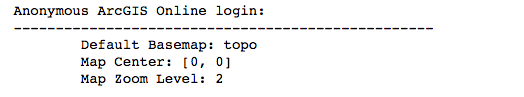
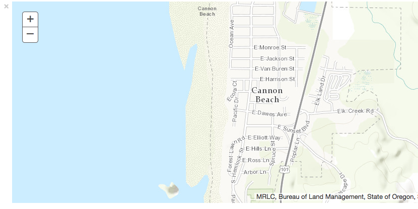

# Test your Python API installation

See the README for installation requirements and instructions.

The [ArcGIS API for Python](https://developers.arcgis.com/python) has a pythonic modular design. Whether talking to ArcGIS Online or ArcGIS Enterprise, your GIS is accessed using the `argis.gis` module. The GIS class provides the information model from which you access all the tools to visualize, analyze, manage, and administer your GIS.

Below we'll use ArcGIS Online and access the module's map widget to investigate the default behavior without signing in. Run the cell to bring up the default map.

Click the Open the Command Palette button on the Jupyter Notebook toolbar for instuctions on how to run a cell on the Operating System you use.

> Set the map to a variable for access later in the notebook.

```python
from arcgis.gis import GIS
my_gis = GIS()
map = my_gis.map()
map
```

### Log properties from your map

Let's investigate some default properties when using the map widget this way:

_Object dot notation accesses properties and methods. Type the object's name, followed by a dot, then the tab key to get a listing of all properties and methods on an object._

```python
print("Anonymous ArcGIS Online login:")
print("{:-<50}".format(''))
print("\tDefault Basemap: {}".format(map.basemap))
print("\tMap Center: {}".format(map.center))
print("\tMap Zoom Level: {}".format(map.zoom))
```


### Sign in and create a map

Sign in to https://www.arcgis.com or your own ArcGIS Enterprise to access your Map Viewer. An example is included to show formatting.

> Use the getpass module to hide the password for your portal. Insert your own username and you'll be prompted to enter your password after running the cell. Hit enter after you've typed your password.

```python
import getpass
password = getpass.getpass("Enter password: ")

#p_gis = GIS(<YOUR PORTAL HOME URL>, <USERNAME>, password, verify_cert=False)
#set verify_cert to False if ssl errors are returned regarding security
p_gis = GIS("https://www.arcgis.com", "[your username]", password, verify_cert=False)

# Entering a specific location and Zoom Level controls how the map draws
p_map = p_gis.map("Cannon Beach, OR", 12)
print("Successfully logged in as: " + p_gis.properties.user.username)
p_map
```


### Update a few map properties

```python
p_map.zoom = 15
p_map.height = '175px'
p_map.center = [45.89, -123.96]
# center needs to be a list of longitude, latitude coordinates
```
**This exercise demonstrated how to login to ArcGIS Online (or ArcGIS Enterprise) and load a map with the ArcGIS API for Python. Subsequent labs will demonstrate additional functionality.**

When you're done, your notebook should look like [create-map.ipynb](create-map.ipynb).