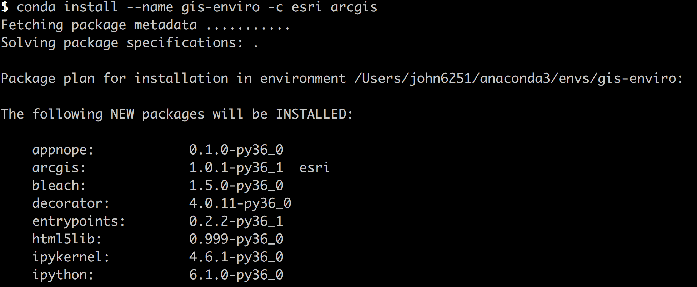

# Setting up an ArcGIS API for Python development environment

There are numerous options for installing the ArcGIS API for Python. Refer to the ArcGIS Developers Website [Get Started documentation](https://developers.arcgis.com/python/guide/install-and-set-up/) to find out more on each option. GeoDev HackerLabs will use the Anaconda Distribution as its method of install and instruction.

[Continuum Analystics' Anaconda](https://www.continuum.io/anaconda-overview) is a comprehensive Python (and [R](https://www.r-project.org/)) package management system comprising more than 100 packages plus mechanisms for installing hundreds of open source packages accessed from various repositories called Channels. Channels may be a default set of cloud locations, such as Anaconda Cloud, or private repositories created by individuals or organizations.

## Install Anaconda

Navigate to the [Anaconda Download page](https://www.continuum.io/downloads) and proceed with installation of the appropriate software for your operating system.

Once installed, interaction with the Anaconda installation primarily occurs through its command-line tool called conda. Conda manages packages and dependencies so they don't interfere with each other through a mechanism called an environment, which is a folder or directory with a specific collection of packages and their dependencies. Core python and other default packages are installed into the default environment, named root. You can choose to keep this core environment isolated and untouched, or install additional packages into the environment before creating environments of your own. Refer to the [core conda documentation](https://conda.io/docs/intro.html) for instructions on managing environments.

## Create an environment with this command:
```bash
conda create --name gis-enviro
```

> You can name your environment anything you want.

## Install the ArcGIS API for Python¶

Esri distributes the ArcGIS Python API in a conda package called arcgis accessible at Esri's channel named esri. Install the arcgis package with the following command. Additional packages, including 'jupyter' (mentioned below), get installed with the arcgis package.
```bash
conda install --name gis-enviro -c esri arcgis
```
**Note**: if you do not enter an environment name, the package will be installed in the root environment.


## Activate the environment

See topic at [Changing Environments](https://conda.io/docs/using/envs.html#change-environments-activate-deactivate) for specific commands based on your OS.

In OSX:
```bash
source activate gis-enviro
```
The ArcGIS API for Python integrates with the Jupyter Notebook. [Jupyter Documentation](https://jupyter.org/) has more information about the suite of software and tools.

## Start the Jupyter Notebook

Navigate to the directory where you want to create notebooks (or where notebooks already exist).
```bash
jupyter notebook
```
If installed correctly, you'll see a message indicating that a web server has started. Your default web browser will launch from your current directory.
Full documentation including samples and an API Reference located at https://developers.arcgis.com/python.