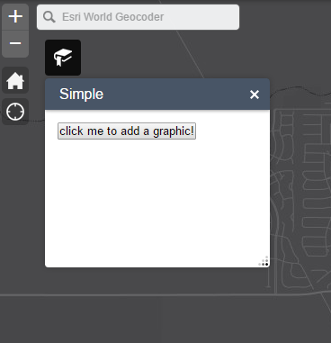

### Web AppBuilder Custom Widget

In this lab you will create a custom widget for Web AppBuilder.

1. Create a New Default (2D)app in Web App Builder. Give it a title `Custom Widget App` and click `Ok`.

2. Click the Plateau Theme and click `Save`.

3. Click the widgets folder (e.g., webappbuilder\server\apps\1\widgets) for the application you just created.

4. Download the [Simple Graphic zip](SimpleGraphic.zip?raw=true), unzip it and copy the folder to the widgets directory.

5. Click the SimpleGraphic folder and edit Widget.js to update the function definition and extend the BaseWidget class:

  ```javascript
  function(declare, BaseWidget, SimpleMarkerSymbol, Graphic) {
    var clazz = declare([BaseWidget], {
      templateString: '<div><input type="button" value="click me to add a graphic!" data-dojo-attach-event="click:_addGraphic"></div>',
      //Add a point at center of extent
      _addGraphic: function() {
        var centerPoint = this.map.extent.getCenter();
        var symbol = SimpleMarkerSymbol();

        var myGraphic = new Graphic(centerPoint, symbol);
        this.map.graphics.add(myGraphic);
      }
    });	
  ```

6. Click the config.json file associated with the application (e.g., webappbuilder\server\apps\1) and add the uri to include the widget in the widget array. Insert the JSON after line 40. 
  
  ```json
  {
  "uri": "widgets/SimpleGraphic/Widget",
    "position": {
      "left": 55,
      "top": 45,
      "width": 250,
      "height": 210
    }
  },
  ```

7. Now launch your application and click the bookmark icon and test the widget. If the widget does not appear, do any errors appear in the developer tools?

 
 
 Your code should look like this:
 * [Widget](simplegraphic_widget.js)
 * [Config](simplegraphic_config.json)
