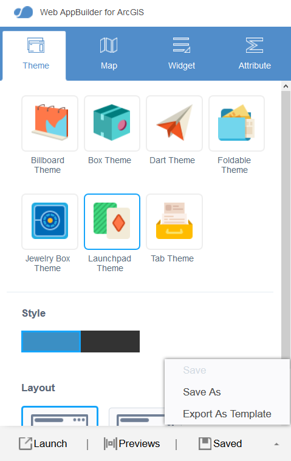
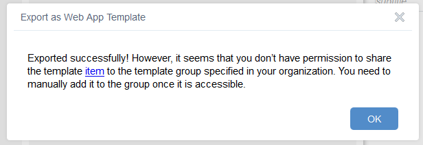
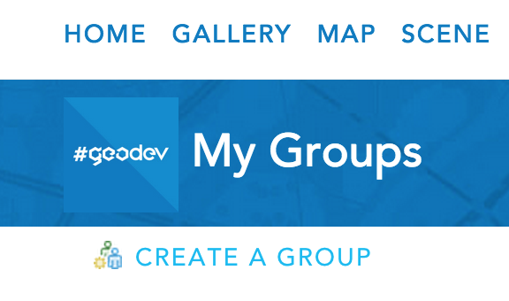

### Deploy your Web AppBuilder project to ArcGIS Online

Now that you have a customized Web AppBuilder application running on your own web server, we can make it available for other webmap authors in our Organization to take advantage of as well.

In this exercise, you will:
* **Register your local application as an ArcGIS Online Item**
* **Create a new group to share the item**
* **Ensure that ArcGIS Online is using content from this group when displaying templates**

1. On the Web AppBuilder homepage http://yourmachinename:3344/webappbuilder, click `Configure App` for the application you would like to export as template.

2. In the `Theme` tab click the `^` to the right of the Saved button > `Export As Template` and select the individual options you want to make configurable for webmap authors later and then click `Export` > `Export to My Organization`.

  

3. Give the template a name, tags, description and save it in your folder of choice and click `OK` and `Close`.
    
  * If you have not configured ArcGIS Online to share custom templates you will see the following message below. Proceed to step 4. 
  * If you have configured ArcGIS Online to share custom templates click `here` to see the details of the exported template and proceed to step 7.  

  

4.  Click `item` to view your template > `Groups` (in the top header of the ArcGIS Online page) and choose `Create a Group`.  Fill in the appropriate details and share the Group within your organization.
  
  

5. Click `My Organization` > `Edit Settings` > `Map` and in the `Configurable Apps` choose the new group from the dropdown and click `Save`.

6. Share your new template with this group.

7. Test your template in the Map Viewer by creating an application with this configurable template.
