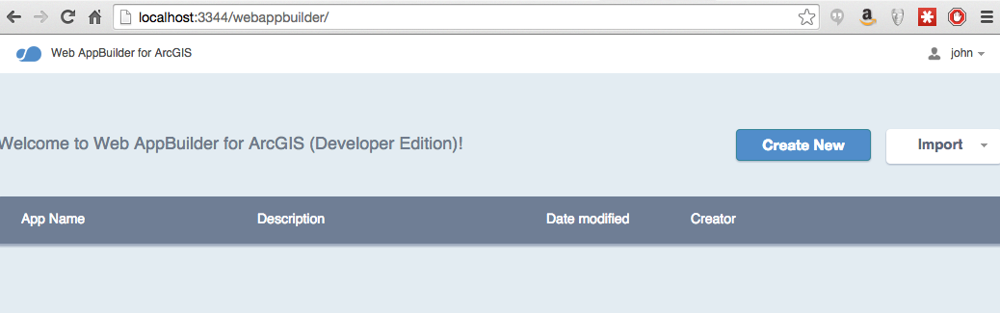

### Configure Web AppBuilder Developer Edition

In order to integrate custom widgets and themes in Web AppBuilder

In this lab you will download Web AppBuilder Developer Edition and configure it to run on your local machine.

1. Download `arcgis-web-appbuilder-1.x.zip` drom [developers.arcgis.com](https://developers.arcgis.com/en/downloads/) and unzip the folder on your own machine.

2. Follow the instructions [here](https://developers.arcgis.com/web-appbuilder/guide/getstarted.htm) to confirm the builder is running.

3. Create an AppID for Web AppBuilder in arcgis.com so that it can leverage OAuth to sign you into ArcGIS Online (more info can be found [here](https://developers.arcgis.com/web-appbuilder/guide/getstarted.htm))

Now you should be able to start creating new applications in the browser on your development machine by visiting http://localhost:3344/webappbuilder

* [Code](src/neighborhood_search_jsapi.html)
* [Live App](http://esri.github.io/geodev-hackerlabs/develop/src/neighborhood_search_jsapi.html)

###Extras
* Install on a Mac!